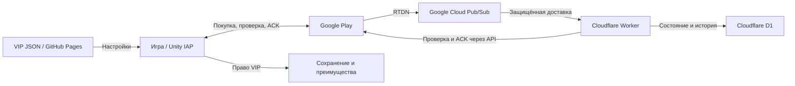
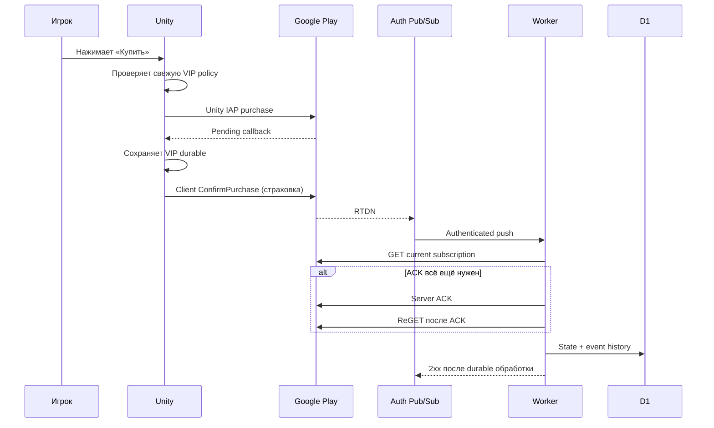

# VIP: как устроены покупка, право доступа и восстановление

*Обзор для владельца игры. Состояние проверено 19 сентября 2026 года; это описание текущей тестовой инфраструктуры и клиентского контракта, а не обещание готовности production-релиза.*

## Главное

VIP состоит из трёх связанных, но самостоятельных частей. Google Play принимает оплату и хранит актуальное состояние подписки. Unity-приложение получает это состояние через Unity IAP 5.4.3, сохраняет право VIP (entitlement) локально и применяет игровые преимущества. Отдельный Cloudflare Worker слушает уведомления Google Play, перепроверяет их через Google Play API и ведёт серверный журнал. Worker не является API проверки для игры: в V1 нет вызова Unity → Worker `/verify`, и D1 не является источником, из которого игра получает право VIP.

Уведомление RTDN означает «состояние могло измениться», а не само состояние. Worker принимает его через аутентифицированный Google Cloud Pub/Sub push, заново запрашивает текущую подписку у Google Play, при необходимости подтверждает оплаченную покупку, ещё ожидающую подтверждения разработчиком, затем сохраняет проверенное состояние в D1. В D1 есть текущая проекция подписки и история событий. Это полезно для аудита, повторной обработки и ручного разбора; игра напрямую к этим данным не подключена.

В клиенте право VIP — локально сохранённое состояние, загруженное через обычное сохранение игры. Успешный определённый ответ магазина может обновить это состояние в обе стороны. Ошибка сети, недоступность магазина или неопределённый ответ не превращаются в отрицательный ответ и не отнимают уже сохранённое право. Локальный кэш не имеет самостоятельного срока истечения: окончательное обновление приходит от успешной проверки магазина.

## Кто за что отвечает

| Участник | Роль | Где находится | Какая информация считается главной |
|---|---|---|---|
| Unity-клиент | Покупка через магазин, локальное право, UI, реклама и VIP-пополнение | [`Corriscant/Minesweeper`](https://github.com/Corriscant/Minesweeper), `C:\UnityProjects\Projects\Minesweeper`, ветка `codex/2026-09-13-17-40-24-vip-subscription` | Определённый ответ Google Play для локального права; локальный кэш для работы без сети |
| Unity IAP | Текущий магазинный адаптер | `Assets/Features/InApp/UnityIapVipStore.cs`, `IVipStore.cs` | Состояние Google Play и локальные callbacks покупки/восстановления |
| Google Play | Оплата, подписка, продление, отмена, истечение и store acknowledgement | Внешний магазин; пакет `com.corriscant.minesweeper`, продукт `vip`, месячный период | Актуальное состояние подписки |
| Billing Worker | Безопасная обработка RTDN, повторный запрос Google, серверное подтверждение покупки и журнал | [`Corriscant/MinesweeperBackend`](https://github.com/Corriscant/MinesweeperBackend), локальная копия `C:\UnityProjects\Projects\MinesweeperBackend`; deployed test Worker `https://minesweeper-vip-billing-test.corriscant-games.workers.dev` | Только повторно полученное состояние Google Play; RTDN — триггер |
| D1 | Текущая серверная проекция и история обработки | База `minesweeper-vip-billing-test`, привязка `DB` в `wrangler.jsonc`, таблицы `subscriptions` и `subscription_events` | Аудит backend; это не клиентское хранилище права VIP |
| VIP policy | Управление доступностью новых покупок и совместимостью описания | `D:\Work\Corriscant.github.io\config\vip\android\v1\prod.json`, [endpoint](https://corriscant.github.io/config/vip/android/v1/prod.json) | Свежий валидный документ с монотонной revision |
| Старый ads JSON | Совместимость старых клиентов рекламы | `D:\Work\Corriscant.github.io\config\ads\android\v1\prod.json` и staging-вариант | Старая конфигурация; VIP-политика теперь читается отдельно |

Исходники backend и вся история коммитов сохранены в приватном репозитории GitHub. Ветки main и codex/2026-09-18-vip-billing опубликованы 19 сентября 2026 года на коммите fb9dd8c. Отправка кода в GitHub и развёртывание Worker в Cloudflare — отдельные действия; push сам по себе не обновляет работающий сервер. На test-инфраструктуре базовые end-to-end сценарии RTDN, повторной проверки Google, ACK и записи D1 пройдены. Это подтверждает рабочий путь, но не означает production readiness: для production нужен отдельный цикл ресурсов Cloudflare, учётных данных, Pub/Sub, D1 и полного приёмочного контроля. Endpoint `/health` test Worker отвечает.

Тестовый Worker использует Google project `minesweeper-classic-corris` и Pub/Sub topic `minesweeper-vip-rtdn-test`; уведомление приходит только через аутентифицированный push.

## Как проходит покупка

Обычная покупка начинается в VIP-окне. Клиент проверяет, что в текущем сеансе есть действующая VIP-политика и она разрешает новую покупку, затем просит Unity IAP провести её напрямую через Google Play. После сообщения магазина об оплаченной покупке приложение сначала надёжно записывает VIP и идентификатор выполненной транзакции в сохранение. Только после успешной записи вызывается клиентский `ConfirmPurchase` — подтверждение покупки со стороны Unity IAP. Повторное уведомление той же покупки обрабатывается без повторной выдачи права.

Параллельно Google Play отправляет RTDN. Worker проверяет подпись push-сообщения Pub/Sub, принимает сообщение один раз по `messageId`, получает текущее состояние подписки через Google Play API, а не доверяет старым полям уведомления. Если Google показывает подходящую незавершённую покупку, Worker делает серверное подтверждение и ещё раз читает состояние. После этого записывает `subscriptions` и `subscription_events`. Если Google или подтверждение временно недоступны, событие остаётся повторяемым, а Pub/Sub получает ответ об ошибке для повторной доставки. Повторная доставка помогает пережить временный сбой, но не является гарантией вечной доставки: после длительного отключения нужна ручная проверка журналов и состояния.

Клиентское подтверждение покупки сохранено намеренно как страховка при недоступности или задержке сервера. Серверное подтверждение нужно, чтобы покупка могла быть подтверждена даже при закрытой игре. Это два независимых защитных пути, а не схема «сначала ждать Worker». Клиент не ждёт Worker и не отправляет ему данные покупки; сервер не полагается на запуск игры. Подтверждение покупки Google Play также не следует путать с подтверждением доставки Pub/Sub.

Сценарий вне игры уже проверен на тестовом пути: старая подписка истекла, новая была оформлена из Google Play при принудительно остановленной игре, Worker подтвердил её, а следующий запуск Unity обнаружил VIP и позволил выполнить VIP-пополнение. Это подтверждает полезность server-only ACK, но не превращает test Worker в production-инфраструктуру.

## Политика, реклама и запуск

Новый VIP JSON отделён от ads JSON. Он содержит `enabled`, `minPurchaseVersionCode`, `minBenefitsVersionCode`, `benefitsRevision`, `revision` и время обновления. Сейчас опубликованный baseline для Android — `enabled=true`, `benefitsRevision=1`, оба минимальных version code равны 44. `enabled=false` и минимальная версия покупки блокируют новые покупки. Минимальная версия преимуществ или неизвестная для старого клиента `benefitsRevision` могут попросить обновить игру или показать предупреждение об описании. Тексты и состав преимуществ встроены в клиент; JSON не переписывает их.

Эти поля не отзывают уже купленный VIP. Сохранённое право и встроенное описание преимуществ остаются доступны; policy управляет предложением и совместимостью будущих действий. Время свежести нужно для запуска очередной проверки и само по себе не отнимает право и не закрывает покупку. Если запрос временно не удался, клиент продолжает использовать последнюю успешно принятую policy текущего сеанса. Если в сеансе ещё нет принятой policy или новый ответ повреждён и признан недействительным, новая покупка закрывается до валидного документа. Policy не сохраняется на диск как отдельный кэш, поэтому после полного перезапуска без успешной загрузки покупка снова требует валидной policy.

Обновление policy запускается жизненным циклом приложения, возвратом из фона, восстановлением сети, периодической проверкой и открытием VIP-окна. Запросы объединяются, повторные попытки ограничиваются паузой и не должны создавать шквал обращений. Провайдер рекламы выбирается на запуске и не переинициализируется из-за обновления VIP policy. Старый ads JSON остаётся для прежних клиентов, а новый VIP JSON не меняет их рекламную конфигурацию.

## Если что-то недоступно

| Ситуация | Что видит и может делать игрок | Что происходит с данными |
|---|---|---|
| Оффлайн | Уже сохранённый VIP продолжает работать; VIP-пополнение использует локальное состояние. | Право VIP не обнуляется и не получает локальный срок истечения. Проверка policy и магазина ждёт восстановления сети. |
| Worker временно недоступен | Клиентский путь через Google Play не зависит от прямого вызова Worker; уже выданный VIP не отзывается из-за ошибки сервера. | RTDN с временной ошибкой повторяется Pub/Sub, а серверный журнал догоняет состояние после восстановления. Это не гарантия вечной доставки; долгий сбой требует ручной проверки. |
| Google Play или Unity IAP недоступны | Новая покупка и определённая проверка магазина не могут завершиться. Уже сохранённый VIP продолжает работать. | Неопределённый результат не записывается как отзыв; повторная проверка запускается позже. |
| Связь с policy временно не удалась | Новая покупка использует последнюю принятую policy текущего сеанса, если она есть; отсутствие принятой policy закрывает новую покупку. | Ошибка транспорта или пустой ответ не стирают прежнее решение. Отдельного policy-кэша на диске нет. |
| Получен невалидный policy JSON | Новая покупка закрыта. Уже купленный VIP и локальные преимущества сохраняются; повреждённый документ не становится основанием для отзыва. | Свежий полученный, но невалидный документ переводит policy в состояние invalid; entitlement остаётся отдельным. |
| Google дал определённый отрицательный ответ | После успешной полной проверки клиент может сохранить `None`, если магазин действительно подтвердил отсутствие права. | Неопределённая ошибка этого не делает. Реальный отзыв или истечение подписки определяется store-состоянием, а не policy и не D1-записью. |

## Что менять и где

Изменение разрешения новых покупок или требований к версии клиента делается в отдельном VIP JSON с новой `revision` и свежим временем. Тексты и состав преимуществ меняются в Unity-клиенте, потому что JSON их не заменяет. Перед публикацией policy нужно убедиться, что совместимый клиент уже доступен игрокам. Изменение продукта, периода или процесса магазина относится к Unity IAP и Google Play Console, а не к policy JSON.

Изменение права VIP, сохранения, рекламного подавления или VIP-пополнения относится к Unity `VipService`, `GameSaveService`, `VipRefillPolicy` и адаптеру `UnityIapVipStore`. Игровая логика знает только право и возможности пополнения; конкретный SKU и управление подпиской находятся за границей адаптера магазина. Серверные правила RTDN, повторного запроса Google, подтверждения покупки, защиты от повторов и D1-аудита меняются в `MinesweeperBackend`; клиент для этого не должен получать новый `/verify`.

## Текущие границы и открытые вопросы

Backend покрыт интеграционными тестами Worker/D1 и mock-ответами Google; базовые end-to-end сценарии RTDN, повторной проверки Google, подтверждения покупки и записи D1 пройдены на test-ресурсах. Это подтверждает рабочий путь, но test-Worker, test-D1 и связанные учётные данные ещё не следует называть production-ready. Автоматизация Google Review Refund / chargeback отложена как optional: событие `PendingRefundReview` аудируется, а фактический отзыв права определяется новым запросом актуального состояния Google Play и отражается отдельным путём. Сейчас в клиенте полноценно поддержаны RU и EN; остальные локали остаются явно учтённым долгом.

В документе намеренно не смешаны серверный журнал, магазинный entitlement и UI policy. Такое разделение позволяет пережить сбой одного слоя, сохранить право игрока и разбирать спорные покупки по аудиту, не выдавая вспомогательную D1-проекцию за источник игрового доступа.

Технические примечания: источники и спорные места

- Backend: `README.md`, `wrangler.jsonc`, `src/auth.ts`, `src/rtdn.ts`, `src/google-play.ts`, `src/processor.ts`, `src/db.ts`, `migrations/0001_initial.sql`; состояние рабочей ветки `codex/2026-09-18-vip-billing`, HEAD `fb9dd8c`.
- Unity: `1/VIP/VIP_Next_Chat_Handoff_2026-09-19.md`, `VIP_Store_Recovery_Coordination_2026-09-19.md`, `VIP_00_Current_State_And_Architecture.md`, а также актуальные `VipService.cs`, `UnityIapVipStore.cs`, `VipRemotePolicy.cs`, `VipConfig.cs`, `VipConfig.asset` и `BillingMode.json`.
- Конфигурация: `D:\Work\Corriscant.github.io\config\vip\android\v1\prod.json`; проверено содержимое baseline revision 10 на дату обзора.
- Git remote проверен без вывода credentials: Unity — `https://github.com/Corriscant/Minesweeper`, backend — `https://github.com/Corriscant/MinesweeperBackend`.
- Состав backend, текущий URL Worker и baseline policy следует перепроверить перед production-релизом. Отложенный Review Refund, ручная обработка реальных возвратов и будущая поддержка дополнительных локалей не являются частью текущего клиентского ACK-контракта.

## Где читать и редактировать этот документ

- Онлайн: https://corriscant.github.io/docs/vip/ ; оглавление: https://corriscant.github.io/docs/ .
- Исходники: `D:\Work\Corriscant.github.io\docs\vip\` в репозитории https://github.com/Corriscant/Corriscant.github.io . HTML и Markdown следует обновлять вместе; автоматической генерации нет.
- Публикация — GitHub Pages из ветки `main`. На главной ссылки нет, в HTML стоит `noindex,nofollow`, но ограничения доступа и пароля нет.
- Бэкенд локально: `C:\UnityProjects\Projects\MinesweeperBackend`. Сервер: https://minesweeper-vip-billing-test.corriscant-games.workers.dev ; состояние: `/health`, вход RTDN: `/rtdn/google-play`.
- Сервер и игра обрабатывают покупку независимо и параллельно. Подтверждение покупки (ACK) сообщает Google, что разработчик её обработал; повторной оплаты оно не создаёт.

`revision` — номер изменения JSON; `benefitsRevision` — версия набора преимуществ, которую понимает клиент. Поля `minPurchaseVersionCode` и `minBenefitsVersionCode` используют Android versionCode. Канал `prod.json` и тестовая среда бэкенда независимы.
